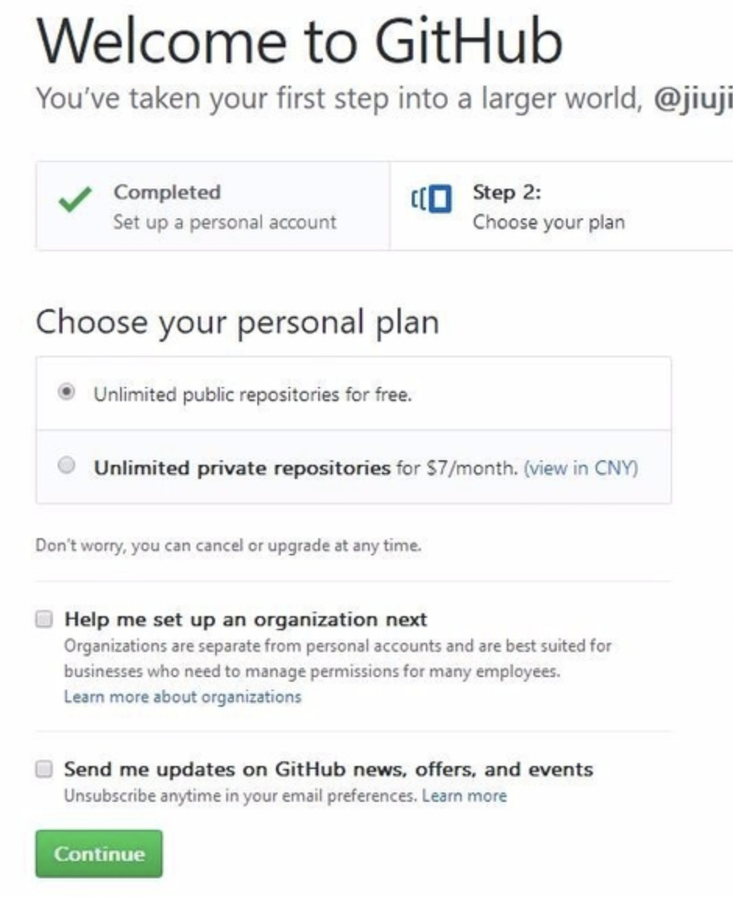
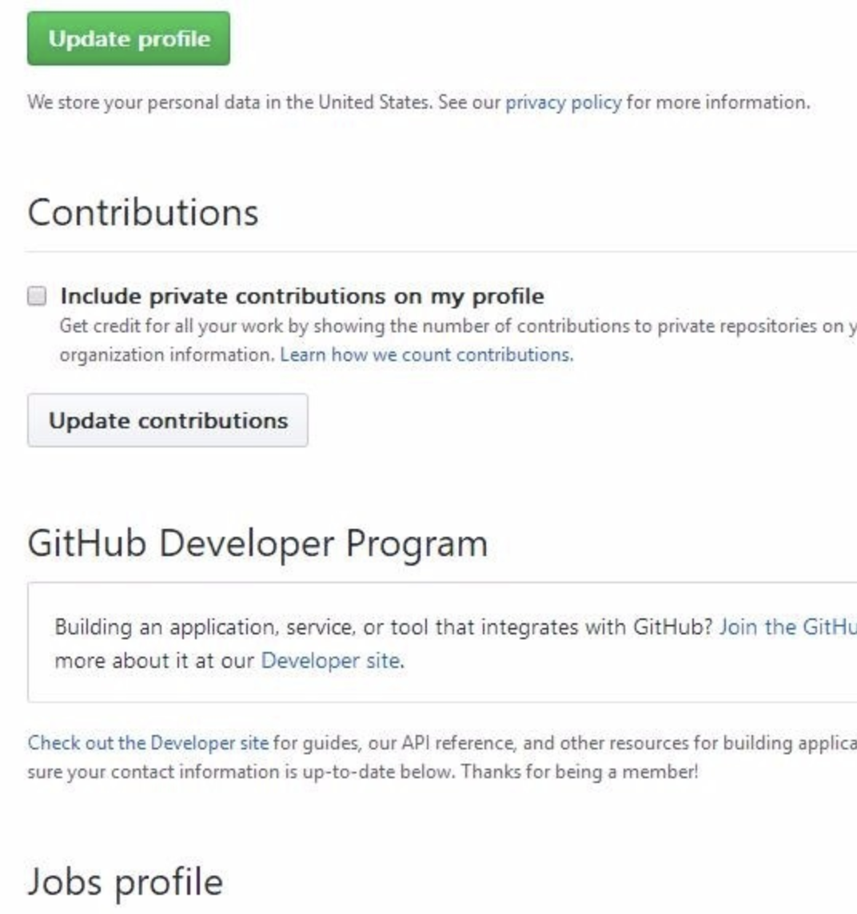

## 推荐

我这里是 github 和 jekyll 搭建的博客，参考链接如下：
https://www.cnblogs.com/wxyww/p/xiaoshujiang.html

因为本人使用的是 mac，因此我是按照 mac 的安装使用方法来介绍的。

## 用到的工具

1. github desktop（个人感觉十分方便，还可以轻松查看他人的提交对比，也是比较复合我个人审美的）
官网链接：https://desktop.github.com/

## 搭建前准备

* nvm、node、npm

nvm 和 n 都是 node 版本管理工具.<br>
而在 mac 上需要先安装 nvm 再使用 nvm 命令安装相应的 node（npm 在 node 安装时便会被安装） 和 npm.<br>

nvm 的 github 地址<br>
https://github.com/nvm-sh/nvm

* nvm 安装命令

```
curl -o- https://raw.githubusercontent.com/nvm-sh/nvm/v0.36.0/install.sh | bash
```

具体版本需要自己打开上面 nvm 的 github 地址查看.<br>
curl 是常用命令行工具，用来请求 web 服务器，mac 中自带的工具.<br>

* nvm 验证命令

```
command -v nvm
```

* node、npm 安装

```
nvm install v12.19.0
nvm list
```

nvm install 安装 node 的版本（我是在官网看了一下 node 的版本号）<br>
nvm list 查看 nvm 安装的 node 版本.<br>

## github

### 申请账号

* github 官网
https://github.com/

* step1


1. 点击右上角的 sign up（注册），然后会跳到注册页面.
2. 第一行是填写注册的名字（name）.
3. 第二行是填注册的邮箱（email）.
4. 第三行是填写密码（password）.
5. 然后点击 create account.

* step2



这里是选择计划，这里有两个选择，一是创建公开仓库（repository），而是创建个人仓库（private），但创建个人需要费用。选好后，点击 continue，到此，创建完毕.

* step3



完善你的信息（tailor your experience），就是填写一些你的简历。到此，账号差不多注册完了.

## 未写完，先将文章发布测试一下博客功能

